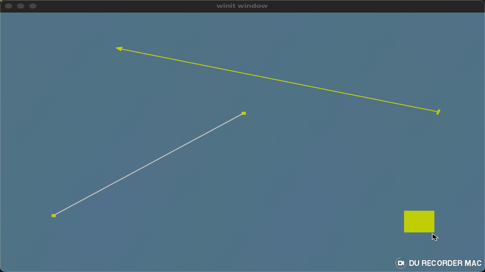

# ZeroDisk

Приложение для создания скриншотов с экрана, их редактирования и хостинга на собственном сервере

## Цели
- минимальное использование библиотек
- испытать объектную модель `Rust` для отрисовки графики, научиться строить абстракции без использовании `ООП` 
- изучить принцип работы с видео картой и ее возможности для расчетов графики и алгоритмов
- запустить редактор изображения в браузере с использованием `wasm`
- написать асинхронный сервер для сохранения, обработки и раздачи сохраненных файлов, изображений

## Библиотеки

- `wgpu` - максимально простая библиотека, которая может работать с видео картой, подключается к ней и передает данные, команды
- `winit` - работа с окнами в ОС

## Клиентская часть

Пример формирования стрелки из написанной библиотеки

```rust
    // Создание частей для отрисовки стрелки
    let arrow_start = Object::new(RectangleMesh::new(25, 8))
        .position(point(100, 100))
        .color(rgb(max, max, 0))
        .build();
    let arrow_line = Object::new(RectangleMesh::new(4, 100))
        .color(rgb(max, max, 0))
        .build();
    let arrow_target = Object::new(TriangleMesh::new(25))
        .position(point(300, 100))
        .color(rgb(max, max, 0))
        .build();

    // Ограничение - начало стрелки смотрит на его кончик
    let arrow_con1 = DirectConstraint::new(
        arrow_start.id.clone(),
        arrow_target.id.clone(),
        Axis::Y,
        true,
    );
    // Ограничение - кончик стрелки смотрит на его начало
    let arrow_con2 = DirectConstraint::new(
        arrow_target.id.clone(),
        arrow_start.id.clone(),
        Axis::Y,
        true,
    );
    // Ограничение - линия между кончика располагается посередине, 
    //   поворачивается на необходимый угол 
    //   и растягивается на расстояние между началом и стрелкой
    let arrow_con3 = BetweenConstraint::new(
        arrow_line.id.clone(),
        arrow_start.id.clone(),
        arrow_target.id.clone(),
        |object, params| {
            object.rotate(params.angle);
            object.position(params.middle);
            object.mesh(RectangleMesh::new(4, params.distance))
        },
    );

    // Формирование итоговой сцены
    let mut scene = Scene::new();
    scene.add_objects(vec![arrow_start, arrow_line, arrow_target]);
    scene.add_constraints(vec![
        Box::new(arrow_con1),
        Box::new(arrow_con2),
        Box::new(arrow_con3),
    ]);
    scene.process();
```
Результат работы клиентской части


## Серверная часть

> В разработке.

Рассматривается вариант использования tarantool для хранения файлов и масштабирования в кластер
